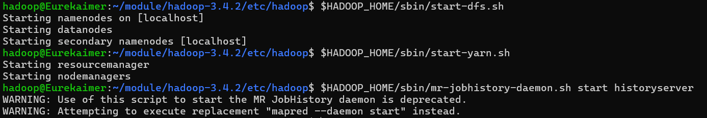

# 分布式存储与计算_LAB

## Lab 1

!!! note "第一次上机实验"
    目的：熟悉 Linux 系统和基本命令
    实验环境：Linux 操作系统（可以使用 Ubuntu on windows,iOS 系统中的 Term）


    对于大多数未曾使用过 Linux 操作系统的人来说，使用 WSL 是一种捷径，使用 Ubuntu 则可以更好的修改各种错误（因为大多数人都使用这一发行版，并且本教程也基于 Ubuntu）

    跳过 WSL 的安装，因为实在是没有难度，你当然也可以使用虚拟机，我推荐你使用 Virtual Box，只需要修改教程相关的路径部分即可，但是我需要提醒你不要吝啬虚拟机的内存，否则会出现节点资源不足而停摆的情况

### 0.帮助命令

比如查看 ls 命令的帮助，可以输入

```Shell
man ls & ls --help 
```

### 1.文件操作命令的使用

+ 查看文件与目录 ls 进入 Linux 系统，输入 ls 回车(回车后命令运行，此后的说明中省略回车 尝试 ls 的其它参数

```Shell
ls -a
ls -l
ls -lrth
```

+ 用 vim 或者 vi 编辑器新建一个 test.txt 文件（使用方式请自行搜索），在文件中键入任意内容：比如 this is test 保存，退出

```Shell
vi test.txt
// 如果安装了vim可以直接使用vim
vim test.txt
// 按i进入insert模式
this is test
// 保存并退出
:wq
```

+  ls 查看当前目录下新生成的文件 test.txt

+ 显示文件内容 cat

```Shell
cat test.txt 
```

+ 复制文件 test.txt 到文件

```Shell
cp test.txt test1.txt
cp test.txt test2.txt 
```

+ 删除命令 rm，输入 rm testl.txt


+ 移动命令，输入 mv test2.txt test1.txt

### 2.目录命令的使用

+ cd 命令（该命令用来改变当前目录）

```Shell
cd mytest
```

+ mkdir 命令（用于在当前目录下建立一个子目录）

```Shell
mkdir mytest
```


+ rmdir 命令（移除当前目录下的目录）

```Shell
rmdir mytest1
```

+ pwd（显示当前路径）

```Shell
pwd
```

+ 移动 test.txt 文件（假设该文件在~/目录下)到当前目录下

```Shell
mv test.txt ./ cd ~ rmdir mytest\
rm -rf mytest
```

### 3.重定向输入输出，比较>和>>的作用


```Shell
 cat test1.txt 
 cat test1.txt > test.txt 
 cat test.txt test1.txt > test2.txt 
 cat test2.txt 
 cat test.txt test1.txt >> test2.txt 
```


### 4.管道命令

```Shell
 cat test2.txt|wc 
 cat test2.txt|awk '{print $3}'
```


## Lab 2

这个部分老师的操作文档写的非常混乱，我结合林子雨老师的教材和自己的经验进行一些修改以便于操作（也修改了一些安装顺序），下面是修改后的安装步骤

### 1.创建新的 hadoop 账户

```Shell
// sudo adduser <username>
sudo adduser hadoop
sudo vim /etc/sudoers
// insert module
hadoop ALL=(ALL:ALL) ALL
// 加入位置可以选择在sudo下方
```

切换账户

```Shell
su hadoop
```

新建两个文件夹用来后续操作

```Shell
mkdir software
mkdir module
```

### 2.安装两个基本文件

+ JDK8
+ Hadoop3.4.2


!!! warning "软件版本"
    需要注意的是，软件是会随着时间迭代的，因此版本号和文件名显然也会跟着改变，所以下面的一切与这两个文件有关的命令都需要注意修改对应的版本号进行操作

+ JDK 的安装

首先进入网址：[JDK_downloads](https://www.oracle.com/java/technologies/downloads/)，你可以在Java achieve中找到对应的版本，例如我使用JDK8就使用了[jdk-8u451-linux-x64.tar.gz](https://www.oracle.com/java/technologies/javase/javase8u211-later-archive-downloads.html)，安装在windows下即可

+ Hadoop 的安装

直接进入[官网](https://hadoop.apache.org/releases.html)安装即可，选择Binary版本，同样安装在windows下

安装之后需要记住位置，后续需要在 wsl 中通过 mnt 来进行传输

如何传输？

假设您的文件在 Windows 路径为 `D:\Users\YourName\Documents\my_file.txt`，并且您想把它转移到 WSL 中当前用户的家目录 (`~`) 下

示例路径：

windows：D:\Users\YourName\Documents\my_file.txt

wsl：/mnt/d/Users/YourName/Documents/my_file.txt


!!! tip "窍门"
    只需要在前面加上/mnt，在哪个盘就在后面跟上盘符，例如 D 盘就加上/d，后面只需要改变反斜杠即可

然后就是 mv 命令，前面是原位置，后面是移动后希望文件所处的位置

```Shell
mv /mnt/d/Users/YourName/Documents/my_file.txt ~/target_directory/
```

将那两个安装包从 windows 下移动到 `~/software` 下（注意文件名需要根据你下载到的实际文件修改，路径也需要根据实际所处的位置修改）

以 `hadoop-3.4.2.tar.gz` 为例

```Shell
mv /mnt/d/Users/lenovo/Desktop/hadoop-3.4.2.tar.gz ~/software/
```

使用 ls 命令会得到如下结果

```Shell
hadoop@Eurekaimer:~/software$ ls
hadoop-3.4.2.tar.gz  jdk-8u451-linux-x64.tar.gz
```

然后将这两个压缩包解压到 `module` 文件夹下

以 `jdk-8u451-linux-x64.tar.gz` 为例

```Shell
tar -xvzf jdk-8u451-linux-x64.tar.gz -C ~/module
```

关于上面命令的 `-xvzf` 中的四个选项的含义可以直接搜索，在此不赘述

### 3.配置环境变量

+ 先配置 JDK 的环境变量，首先回到最初的目录，然后使用 vim 打开配置文件

```Shell
cd
vim ~/.bashrc
```

加入以下内容（推荐加入位置在末尾，内容需要根据实际文件名修改）

注：可以在 `module` 目录下使用 ls 得到

```Shell
hadoop@Eurekaimer:~/module$ ls
hadoop-3.4.2  jdk1.8.0_451
```

添加内容：

```Shell
export JAVA_HOME=/home/hadoop/module/jdk1.8.0_451
export PATH=$PATH:$JAVA_HOME/bin
// 加入后保存退出
:wq
```


```Shell
// 运行source使得配置生效
source ~/.bashrc
// 测试安装是否成功
java -version
```

+ 配置 Hadoop 环境变量

类似的

```Shell
cd
vim ~/.bashrc
```

加入以下内容（推荐加入位置在末尾，内容需要根据实际文件名修改）

注：可以在 `module` 目录下使用 ls 得到

```Shell
hadoop@Eurekaimer:~/module$ ls
hadoop-3.4.2  jdk1.8.0_451
```

添加内容：

```Shell
export HADOOP_HOME=/home/hadoop/module/hadoop-3.4.2
export PATH=$PATH:$JAVA_HOME/bin:$HADOOP_HOME/bin:$HADOOP_HOME/sbin
// 加入后保存退出
:wq
```


```Shell
// 运行source使得配置生效
source ~/.bashrc
// 测试安装是否成功
hadoop version
```

### 4.设置 ssh 免密登录

需要先安装 openssh

```Shell
sudo apt-get install openssh-server pdsh
```

可以先创建一个文件夹 `~/.ssh`

```Shell
cd ~
mkdir .ssh
cd ~/.ssh
ssh-keygen -t rsa 
cd 
cat ~/.ssh/id_rsa.pub >> ~/.ssh/authorized_keys
```

验证是否能够免密登录

```Shell
ssh localhost
```

这个步骤不应输入密码，结束后退出

```Shell
exit
```

!!! tip "关于免密登录的目的"
    为什么要免密登录？想要体会这一点应当在设置免密登录之前直接进行一次 `ssh localhost` 操作，我们会发现登录需要输入密码，而输入密码对于多节点的操作而言是非常麻烦的，因此我们需要设置免密登录

### 5.修改配置文件

主要是三个文件

+ core-site.xml

```Shell
vim core-site.xml
```

`<configuration>` 和 `</configuration>` 之间加入

注意缩进（类似 html 标签）

```Shell

<property>
	<name>fs.defaultFS</name>
	<value>hdfs://localhost:9820</value>
</property>
<property>
	<name>hadoop.tmp.dir</name>
	<value>/home/hadoop/module/hadoop-3.3.6/tmp</value>
</property>
```

+ hdfs-site.xml

```Shell
vim hdfs-site.xml
```

仍然是 `<configuration>` 和 `</configuration>` 之间加入

```Shell
<property>
	<name>dfs.replication</name>
	<value>1</value>
</property>
<property>
	<name>dfs.namenode.secondary.http-address</name>
	<value>localhost:9868</value>
</property>
<property>
	<name>dfs.namenode.http-address</name>
	<value>localhost:9870</value>
</property>
```


+ hadoop-env.sh

```Shell
vim hadoop-env.sh
```

加入以下

```Shell
export JAVA_HOME=/home/hadoop/module/jdk1.8.0_451
export HDFS_NAMENODE_USER=hadoop
export HDFS_DATANODE_USER=hadoop
export HDFS_SECONDARYNAME_USER=hadoop
```

### 6.格式化 HDFS 文件系统

```Shell
hdfs namenode -format
```

### 7.启动集群

```Shell
start-dfs.sh
jps
```

查看服务，打开浏览器输入 `http://localhost:9870`

### 8.运行例子

```Shell
cd
mkdir input
cd input
```


使用 vim 生成测试文件 `test1.txt` 和 `test2.txt`，每个文件输入若干单词

将目录上传到 hdfs 文件系统

```Shell
hdfs dfs -put ~/input /input
cd $HADOOP_HOME/share/hadoop/mapreduce
hadoop jar hadoop-mapreduce-examples-3.4.2.jar wordcount /input /output
```

查看输出目录

```Shell
hdfs dfs -ls /output
```

查看最终结果

```Shell
hdfs dfs -cat /output/part-r-00000
```


!!! note "彩蛋"
    如果统计结果正确，那么说明你的 Hadoop 伪分布式集群就搭建成功并验证完成了！
    我写的是 microsoft love linux!

## Lab 3

第四次上机实验的内容为 YARN 的配置，具体内容如下：

+ 配置并启动 YARN
+ Yarn 中添加队列 small,并将任务提交至 small 队列运行
	+ 修改 capacity-scheduler.xml 文件（最好提前备份该文件 cp capacity-scheduler.xml capacity-scheduler.xml.bak).修改内容包括增加所有和 small 队列相关的属性，并且分配 default 队列和 small 队列之间的资源占有比例。
	+ 向指定队列提交任务
		$hadoop jar $HADOOP_HOME/share/hadoop/mapreduce/hadoop-mapreduce-example-3.4.2.jar pi -Dmapreduce.job.queuename=small 10 10
	+ 在 yarn 的 web 服务页面查看提交的任务情况和队列情况

### 1. YARN 环境配置（承接 HDFS 配置）

主要是修改三个文件

+ mapred-site.xml
+ yarn-site.xml
+ hadoop-env.sh

$\mathbf{Remark:}$ 下面的软件版本都是我的版本，相应的使用需修改

配置第一个

```Shell
cd $HADOOP_HOME/etc/hadoop
# 备份可以不备
cp mapred-site.xml.template mapred-site.xml
vim mapred-site.xml
```

在两个< configuratkion >插入< property > 最后如下：

```Shell
<configuration>
    <property>
        <name>mapreduce.framework.name</name>
        <value>yarn</value>
    </property>
    <property>
        <name>yarn.app.mapreduce.am.env</name>
        <value>HADOOP_MAPRED_HOME=/home/hadoop/module/hadoop-3.4.2</value>
    </property>
    <property>
        <name>mapreduce.map.env</name>
        <value>HADOOP_MAPRED_HOME=/home/hadoop/module/hadoop-3.4.2</value>
    </property>
    <property>
        <name>mapreduce.reduce.env</name>
        <value>HADOOP_MAPRED_HOME=/home/hadoop/module/hadoop-3.4.2</value>
    </property>
    # 后面两条可以不插入
    # 关于端口的部分都可以不插入，因为有默认值
    <property>
        <name>mapreduce.jobhistory.address</name>
        <value>localhost:10020</value>
    </property>
    <property>
        <name>mapreduce.jobhistory.webapp.address</name>
        <value>localhost:19888</value>
    </property>
</configuration>
```

配置第二个

```Shell
vim yarn-site.xml
```

```Shell
<configuration>
    <property>
        <name>yarn.resourcemanager.hostname</name>
        <value>Eurekaime</value> # 这里是你的hostname主机名(主机名是@后面的)
    </property>
    <property>
        <name>yarn.nodemanager.aux-services</name>
        <value>mapreduce_shuffle</value>
    </property>
    # 同理端口可以不接入
    <property>
        <name>yarn.resourcemanager.webapp.address</name>
        <value>Eurekaimer:8088</value># 这里仍然是主机名
    </property>
</configuration>
```

第一个 property 主机名 (hostname)


配置第三个

```Shell
vim hadoop-env.sh
```

末尾添加：

```Shell
export YARN_RESOURCEMANAGER_USER=hadoop
export YARN_NODEMANAGER_USER=hadoop
```


### 2. 启动 Yarn 服务

```Shell
# 如果之前启动过的关闭
$HADOOP_HOME/sbin/stop-all.sh
# 启动HDFS和YARN
$HADOOP_HOME/sbin/start-dfs.sh
$HADOOP_HOME/sbin/start-yarn.sh
$HADOOP_HOME/sbin/mr-jobhistory-daemon.sh start historyserver
```



第三条命令报错是因为给出的这个命令是 Hadoop2.x 版本的，但是它会自动转换为 3.x

如果在 `$HADOOP_HOME` 目录下：

```Shell
stop-all.sh
# HDFS
start-dfs.sh
# Yarn
start-yarn.sh
# 历史服务器
mr-jobhistory-daemon.sh start historyserver
```

检查：

```Shell
jps
```

896 DataNode
1793 JobHistoryServer
1137 SecondaryNameNode
769 NameNode
1570 NodeManager
2439 ResourceManager
2735 Jps

应该能看到至少以下进程：`NameNode`，`DataNode`，**`ResourceManager`**，**`NodeManager`**，`JobHistoryServer`

### 3. 配置并启动 `small` 队列

修改 `capacity-scheduler.xml` 文件

```Shell
cd $HADOOP_HOME/etc/hadoop
# 备份仍然可以不用打
cp capacity-scheduler.xml capacity-scheduler.xml.bak
vim capacity-scheduler.xml
```

这个是比较麻烦的，你需要在文件的 `<configuration>` 和 `</configuration>` 标签之间，加入以下内容。这些配置定义了 `root` 队列下的子队列 `default` 和 `small`，并分配了资源比例（70% 给 `default`，30% 给 `small`）（比例可以调，只需要加和 100%即可）

```Shell
<property>
    <name>yarn.scheduler.capacity.root.queues</name>
    <value>default,small</value># 这行加入small队列
</property>

# default
<property>
    <name>yarn.scheduler.capacity.root.default.capacity</name>
    <value>70</value># 调整比例
</property>
<property>
    <name>yarn.scheduler.capacity.root.default.maximum-capacity</name>
    <value>100</value>
</property>

# small
<property>
    <name>yarn.scheduler.capacity.root.small.capacity</name>
    <value>30</value>
</property>
<property>
    <name>yarn.scheduler.capacity.root.small.maximum-capacity</name>
    <value>30</value>
</property>
```

保险起见应该给每个 property 标签都类似定义相关的 small 队列的版本，例如上面的部分就是两个 default 和两个 small，但是使用时其他属性都存在默认值，所以不配置 small 的标签也可以跑通

```Shell
# 确保配置small队列能够使用(刷新)
yarn rmadmin -refreshQueues
```

### 4. 提交任务

```Shell
hadoop jar $HADOOP_HOME/share/hadoop/mapreduce/hadoop-mapreduce-examples-3.4.2.jar pi -Dmapreduce.job.queuename=small 10 10
```

精度相当差，如果要更高的精度可以调整后面参数 (10 10)


如果要使用 web 端的话，检查一下端口：

```Shell
sudo vim /etc/hosts
```

打开之后进行配置

```Shell
# This file was automatically generated by WSL. To stop automatic generation of this file, add the following entry to /etc/wsl.conf:
# [network]
# generateHosts = false
127.0.0.1       localhost
# 主机名 ip需要统一
127.0.0.1       Eurekaimer.     Eurekaimer
# 用户名
127.0.0.1       hadoop          hadoop
```

重启一下：

```Shell
stop-yarn.sh
start-yarn.sh
yarn rmadmin -refreshQueues
```

然后尝试访问http://localhost:8088

有时候因为防火墙无法访问，所以采取 http 协议，或者把电脑防火墙关掉


!!! warning "关于最后一步提交之后但是无法开始任务"
    也就是一直卡在提交结束，但是任务迟迟没有开始，有可能是因为你的任务需求内存大于你的节点能够提供的内存，对于这种情况（如果使用虚拟机），你需要调整节点最大可用内存，或者降低任务需要内存，也可以虚报内存（所以说安装虚拟机的时候不要把自己的内存配置写的太小了）


## Lab 4

一切文件版本和路径根据自己情况调整

### 1.安装 Spark 3.4.2

使用之前需要 Java 和 Hadoop 环境（很好安装，在之前的 Lab 中已经安装过）

注：下面需要根据自己的 Java/Hadoop/Spark 版本进行，可以使用下面的命令查看

```Shell
cat ~/.bashrc

# 这是我的输出
export JAVA_HOME=/home/hadoop/module/jdk1.8.0_451
export PATH=$PATH:$JAVA_HOME/bin
export HADOOP_HOME=/home/hadoop/module/hadoop-3.4.2
export PATH=$PATH:$JAVA_HOME/bin:$HADOOP_HOME/bin:$HADOOP_HOME/sbin

# 解读：
# Java 版本: jdk1.8.0_451
# Hadoop 版本:hadoop-3.4.2
# Spark 版本（假设下载）: spark-3.4.2-bin-without-hadoop.tgz
```

由于老师的安装文档比较老因此使用的是比较古老的 Spark 版本，只能去[Apache Archive](https://archive.apache.org/dist/spark/spark-3.4.2/)下载(这是本次实验耗时最久的地方)，然后就是正常移动文件(WSL)，如果是虚拟机或是本地Linux正常移动即可

```shell
mv /mnt/e/spark-3.4.2-bin-without-hadoop.tgz ~/software/
```

解压

```shell
tar -xvzf ~/software/spark-3.4.2-bin-without-hadoop.tgz -C ~/module/
```

>PPT 复制下来-C 前面横线格式不对

移动解压文件并改名 spark

```shell
mv ~/module/spark-3.4.2-bin-without-hadoop/ ~/module/spark
```

#### 本地模式

然后开始配置文件 ` spark-env.sh`

```shell
# 仍然备份，但是改动较少不太可能改错
cd ~/module/spark/conf
cp spark-env.sh.template spark-env.sh
vim spark-env.sh
```

在最后加上（老师的课件需要打开两次，这里方便就把后续的配置文件一起写上）

```Shell
# 这是原本的
export SPARK_DIST_CLASSPATH=$(/home/hadoop/module/hadoop-3.3.6/bin/hadoop classpath)
# 这是后面的
export JAVA_HOME=/home/hadoop/module/jdk1.8.0_451 
# 指定 Hadoop 配置文件的目录，用于YARN和HDFS集成
export HADOOP_CONF_DIR=/home/hadoop/module/hadoop-3.4.2/etc/hadoop 
# Standalone Master 的主机名和端口
SPARK_MASTER_HOST=localhost 
SPARK_MASTER_PORT=7077
```

由此可以使用本地模式，如果要使用 HDFS 则需要提前打开 Hadoop

#### Standalone 模式

仍然是那个 `conf` 文件夹

```shell
 cp workers.template workers
 vim workers
 # 里面的改为
 localhost
 # 里面的默认应该就是，这步没必要做
```

启动 Standalone 模式，没必要运行，不想运行直接跳过

```shell
# 需要在spark目录下
 ./sbin/start-master.sh
 ./sbin/start-workers.sh spark://localhost:7077
 jps 
# 应该能看到 Master 和 Worker 进程

 # 不在目录下可以如下操作，但是需要把下面的环境变量$SPARK_HOME先配置好(或者键入正确的目录)
 # 1. 启动 Master 进程 [cite: 281]
$SPARK_HOME/sbin/start-master.sh
# 2. 启动 Worker 进程，连接到 Master [cite: 282]
$SPARK_HOME/sbin/start-workers.sh spark://localhost:7077
# 3. 检查进程
jps 
# 应该能看到 Master 和 Worker 进程
```

配置环境变量：

```Bash
vim ~/.bashrc

# 加入
export SPARK_HOME=/home/hadoop/module/spark
export PATH=$PATH:$SPARK_HOME/bin

# 使得新配置生效
source ~/.bashrc

# 然后应该就可以使用Spark了
spark-shell
# 应该就可以使用spark了，这个需要确认一下，确认完了ctrl C退出
```


### 2.安装 sbt 并配置环境

sbt（Simple Build Tool）用于打包 Scala 编写的 Spark 应用程序

安装的话：[Github](https://github.com/sbt/sbt/releases/download/v1.9.9/sbt-1.9.9.tgz)，[官网](https://www.scala-sbt.org/download/)

安装好了仍然解压安装包

```Shell
tar -xvzf ~/software/sbt-1.9.9.tgz -C ~/module/sbt
# 配置环境
vim ~/.bashrc
# 末尾加入
export PATH=$PATH:~/module/sbt/bin
# 使配置生效
source ~/.bashrc
```

### 3.创建任务

创建文件夹

```shell
mkdir ~/sparkapp
mkdir –p ~/sparkapp/src/main/scala
```

撰写代码

```Shell
vim ~/sparkapp/src/main/scala/SimpleApp.scala
```

加入下面的代码

```Scala
import org.apache.spark.SparkContext
import org.apache.spark.SparkContext._
import org.apache.spark.SparkConf

object SimpleApp {
  def main(args: Array[String]) {
    val logFile = "file:///home/hadoop/module/spark/README.md" // 用于统计的文本文件 [cite: 789]
    val conf = new SparkConf().setAppName("Simple Application") 
    val sc = new SparkContext(conf)
    val logData = sc.textFile(logFile, 2).cache()
    val numAs = logData.filter(line => line.contains("a")).count()
    val numBs = logData.filter(line => line.contains("b")).count()
    println("Lines with a: %s, Lines with b: %s".format(numAs, numBs)) 
    sc.stop() // 补充 sc.stop() 确保程序正常退出，老师课件没写
  }
}
```

声明该应用程序的信息以及与 Spark 的依赖关系

```shell
vim ~/sparkapp/simple.sbt

# 加入
name := "Simple Project"
version := "1.0"
scalaVersion := "2.12.18" // 与 Spark 3.4.2 兼容的 Scala 版本
libraryDependencies += "org.apache.spark" %% "spark-core" % "3.4.2" % "provided" // Spark 依赖版本
```

打包

```Shell
cd ~/sparkapp 
# 2. 编译并打包应用程序 (sbt package)
sbt package 
# 第一次运行时 sbt 会下载依赖包，耗时较久
# 成功后，生成的 JAR 包应当位于 ~/sparkapp/target/scala-2.12/simple-project_2.12-1.0.jar
```

应该会生成一个 jar 包

### 4.提交任务

```shell
#建议使用下面的命令 注意$前面还有$ 并非笔误，那个老师的提交命令又有毛病，class和master前面的横线都少了一个
$SPARK_HOME/bin/spark-submit \
--class "SimpleApp" \
--master spark://localhost:7077 \
~/sparkapp/target/scala-2.12/simple-project_2.12-1.0.jar
```


你应该会在日志中找到这样一个句子

```shell
2025-11-11 09:25:08,414 INFO scheduler.DAGScheduler: Job 1 finished: count at SimpleApp.scala:12, took 0.157960 s
Lines with a: 72, Lines with b: 39
```

这说明成功了

### 5.快速签字检查

一键打开所有

```shell
start-all.sh
```

```shell
cd ~/module/spark
./sbin/start-master.sh
./sbin/start-workers.sh spark://localhost:7077
jps
```

```shell
~/module/spark/bin/spark-submit \
    --class "SimpleApp" \
    --master spark://localhost:7077 \
    ~/sparkapp/target/scala-2.12/simple-project_2.12-1.0.jar
```

到这里所有的需要上机签字的部分就结束了（算平时分的部分），但是对于想要学好分布式的同学来说，熟悉 Scala 语法和代码实现也是不得不品的一环，但是由于本人比较懒就跳过后续的两次 Scala 语言的上机作业了，因为在 LLM 的时代下，你写不出正确的代码说明这门科目不是很适合你了！！！

