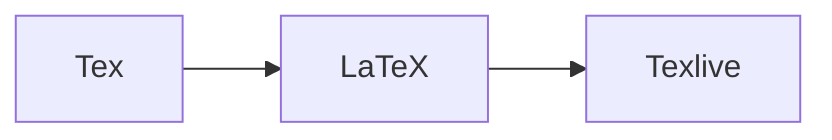

---
tags:
  - LaTeX
  - Wheel
---
# LaTeX(VScode)

对于每个学习理工科的学生而言，熟练使用 $\LaTeX$ 都是一项**必备**的技能点，下面将介绍如何在 VScode 上使用 $\LaTeX$ 以及环境配置

>这份安装手册当时使用的 OS 为 Windows11，但是我确信 NixOS 等 Linux 发行版都可以很好的运行 $\LaTeX$，并且也十分的方便

主要步骤如下：

+ 安装世界上最伟大的 IDE **VScode**
+ 下载 Texlive（实质的排版引擎叫做 Tex，而 $\LaTeX$ 是一个宏命令的集合，其本身无法独立运行，需要一个编译它的工具，一个打包好的完整环境，这里我们选择主流的 Texlive）
+ 在 VScode 中配置 Tex 环境（如今你已经可以让 AI 帮你写配置文件，每个 custom 参数的含义可以自行查询）

关于 Tex、$\LaTeX$、Texlive 关系的进一步阐述：



## 下载 VScode

!!! note "小记"
    向世界上最伟大的 IDE 致敬

只需要在[官网](https://code.visualstudio.com/Download)下载即可

下载结束之后安装一些基本的扩展：

+ Chinese(Simplified)
+ LaTeX Workshop（这个是非常重要的）
+ GitHub Copilot

## 下载 texlive

关于 texlive 的基本知识可以在大多数有关 LaTeX 书籍上找到，在此不做过多的赘述，笔者这里选择[清华源](https://mirrors.tuna.tsinghua.edu.cn/CTAN/systems/texlive/Images/)下载，下载需要比较长的时间(建议你在安装的时候不要安装过多语言的包，尽量简化你的安装内容，全部安装需要非常长的时间)，得到一个基本的iso文件后运行即可安装

主要参考这篇文章即可([知乎文章](https://zhuanlan.zhihu.com/p/166523064))，后编：AI时代没必要参考任何固定的文章，你只需要让AI解释清楚每一步的原因然后自己稍微检索即可(本文现在主要是方便小白做一个了解和基本的扩展？)，大多数人使用的是Overleaf这种在线的编辑器，但是对于头脑比较清晰的人来说不会把自己的全部鸡蛋放在一个篮子里，没有说Overleaf不好的意思，只是你有必要保留一个本地化无限制时间的方案去应对诸如网站崩溃和超时的问题)

其实当你下载好 Texlive 并且安装好扩展之后就可以使用了，下面的环境只是说按照文档固定了一些参数的设置，其中比较关键的几种编译工具是 `XeLaTeX` 和 `PDFLaTeX` 至于引用时使用的 `bibtex` 和专门方便使用的 `latexmk` 可以询问 AI，比较关键的问题是你需要清楚哪些对于中文内容支持更好 (ctex)，哪些很适合全英文使用。

## 环境配置

### 基本参数

在 `Settings` 中修改

```JSON
{
	"latex-workshop.latex.autoBuild.run": "onFileChange",
    "latex-workshop.showContextMenu": true,
    "latex-workshop.intellisense.package.enabled": true,
    "latex-workshop.message.error.show": false,
    "latex-workshop.message.warning.show": false,
    "latex-workshop.latex.tools": [
        {
            "name": "xelatex",
            "command": "xelatex",
            "args": [
                "-synctex=1",
                "-interaction=nonstopmode",
                "-file-line-error",
                "%DOCFILE%"
            ]
        },
        {   
            "name": "pdflatex",
        "command": "pdflatex",
        "args": [
            "-synctex=1",
            "-interaction=nonstopmode",
            "-file-line-error",
            "%DOC%"
        ]
        },
        {
            "name": "latexmk",
            "command": "latexmk",
            "args": [
                "-synctex=1",
                "-interaction=nonstopmode",
                "-file-line-error",
                "-pdf",
                "-outdir=%OUTDIR%",
                "%DOCFILE%"
            ]
        },
        {
            "name": "bibtex",
            "command": "bibtex",
            "args": [
                "%DOCFILE%"
            ]
        }
    ],
    "latex-workshop.latex.recipes": [
        {
            "name": "XeLaTeX",
            "tools": [
                "xelatex"
            ]
        },
        {
            "name": "PDFLaTeX",
            "tools": [
                "pdflatex"
            ]
        },
        {
            "name": "BibTeX",
            "tools": [
                "bibtex"
            ]
        },
        {
            "name": "LaTeXmk",
            "tools": [
                "latexmk"
            ]
        },
        {
            "name": "xelatex -> bibtex -> xelatex*2",
            "tools": [
                "xelatex",
                "bibtex",
                "xelatex",
                "xelatex"
            ]
        },
        {
            "name": "pdflatex -> bibtex -> pdflatex*2",
            "tools": [
                "pdflatex",
                "bibtex",
                "pdflatex",
                "pdflatex"
            ]
        },
    ],
    "latex-workshop.latex.clean.fileTypes": [
        "*.bbl",
        "*.blg",
        "*.idx",
        "*.ind",
        "*.lof",
        "*.lot",
        "*.out",
        "*.acn",
        "*.acr",
        "*.alg",
        "*.glg",
        "*.glo",
        "*.gls",
        "*.ist",
        "*.fls",
        "*.log",
        "*.fdb_latexmk"
    ],
    "latex-workshop.latex.autoClean.run": "never",
    "latex-workshop.latex.recipe.default": "lastUsed", //lastUsed
    "latex-workshop.view.pdf.internal.synctex.keybinding": "double-click",
}
```


>只要你是数学物理系的学生或是大多数理工科的同学，都也许会想要使用 $\LaTeX$ 进行笔记写作，论文排版，完成课程作业，不管你的目的是什么，只要你使用过 Tex 书写代码，哪怕只是使用 markdown 中内嵌的 $\LaTeX$ 公式，你一定曾经困惑于 $\LaTeX$ 代码的复杂和大量重复的 dirty work，消耗大量的时间但是完成的内容并不多，这个时候你会思考如何减少重复的代码量以提高生产效率，你也许见过一位国外小哥使用 Vim+LaTeX 实现在课上写出十分工整的数学笔记甚至使用 Tikz 完成绘图([原文](https://castel.dev/post/lecture-notes-1/))，但是想要积累如此多的代码片段和熟练使用Vim并不是一般的理科学生能够做到的，笔者在这里通过**在Vscode中撰写Snippets的方式复现Obsidian中的LaTeX Suite插件的方式**，以尽可能小的成本实现效率的尽可能大的提高.


补一个笔者自己的配置，只想快速使用 LaTeX 不需要配置

## Snippets 配置（可选）

```JSON
{
    // LaTeX snippets
    // This file contains LaTeX snippets for various mathematical symbols, operations, and environments.
    // Each snippet has a prefix, body, description, and scope.
    // The prefix is the shortcut to trigger the snippet, the body is the actual LaTeX code,
    // the description explains what the snippet does, and the scope indicates where the snippet can be used.
    // The snippets are organized into categories for better organization.

    "Math mode inline": {
        "prefix": "mk",
        "body": "$$0$",
        "description": "Math mode - inline with placeholder 0",
        "scope": "latex"
    },
    "Math mode display": {
        "prefix": "dm",
        "body": "$$\n$0\n$$",
        "description": "Math mode - display with placeholder 0",
        "scope": "latex"
    },
    "Begin environment": {
        "prefix": "beg",
        "body": "\\begin{$1}\n$0\n\\end{$1}",
        "description": "Begin and end LaTeX environment",
        "scope": "latex"
    },
//--------------------------------------------------------------
//--------------------------------------------------------------
//--------------------------------------------------------------
"IID": {
    "prefix": "IID",
    "body": "\\overset{IID}{\\sim}",
    "description": "Independently and identically distributed symbol",
},
"meato": {
    "prefix": "meato",
    "body": "\\Rightarrow",
    "description": "converges in measure to",

},
"likehood": {
    "prefix": "likehood",
    "body": "f(x_{1},x_{2},\\dots,x_{n}|\\theta)",
    "description": "likehood function",

},
//--------------------------------------------------------------
//--------------------------------------------------------------
//--------------------------------------------------------------
"@a": {
    "prefix": "@a",
    "body": "\\alpha",
    "description": "Greek letter alpha",

},
"eta": {
    "prefix": "eta",
    "body": "\\eta",
    "description": "Greek letter eta",

},
"@b": {
    "prefix": "@b",
    "body": "\\beta",
    "description": "Greek letter beta",

},
"@g": {
    "prefix": "@g",
    "body": "\\gamma",
    "description": "Greek letter gamma",

},
"@G": {
    "prefix": "@G",
    "body": "\\Gamma",
    "description": "Capital Greek letter Gamma",

},
"@d": {
    "prefix": "@d",
    "body": "\\delta",
    "description": "Greek letter delta",

},
"@D": {
    "prefix": "@D",
    "body": "\\Delta",
    "description": "Capital Greek letter Delta",

},
"@e": {
    "prefix": "@e",
    "body": "\\varepsilon",
    "description": "Greek letter epsilon",

},
"@z": {
    "prefix": "@z",
    "body": "\\zeta",
    "description": "Greek letter zeta",

},
"@t": {
    "prefix": "@t",
    "body": "\\theta",
    "description": "Greek letter theta",

},
"@T": {
    "prefix": "@T",
    "body": "\\Theta",
    "description": "Capital Greek letter Theta",

},
":t": {
    "prefix": ":t",
    "body": "\\vartheta",
    "description": "Variant of Greek letter theta",

},
"@i": {
    "prefix": "@i",
    "body": "\\iota",
    "description": "Greek letter iota",

},
"@k": {
    "prefix": "@k",
    "body": "\\kappa",
    "description": "Greek letter kappa",

},
"@l": {
    "prefix": "@l",
    "body": "\\lambda",
    "description": "Greek letter lambda",

},
"@L": {
    "prefix": "@L",
    "body": "\\Lambda",
    "description": "Capital Greek letter Lambda",

},
"@s": {
    "prefix": "@s",
    "body": "\\sigma",
    "description": "Greek letter sigma",

},
"@S": {
    "prefix": "@S",
    "body": "\\Sigma",
    "description": "Capital Greek letter Sigma",

},
"@u": {
    "prefix": "@u",
    "body": "\\upsilon",
    "description": "Greek letter upsilon",

},
"@U": {
    "prefix": "@U",
    "body": "\\Upsilon",
    "description": "Capital Greek letter Upsilon",

},
"@o": {
    "prefix": "@o",
    "body": "\\omega",
    "description": "Greek letter omega",

},
"@O": {
    "prefix": "@O",
    "body": "\\Omega",
    "description": "Capital Greek letter Omega",

},
"ome": {
    "prefix": "ome",
    "body": "\\omega",
    "description": "Greek letter omega",

},
"Ome": {
    "prefix": "Ome",
    "body": "\\Omega",
    "description": "Capital Greek letter Omega",

},
//--------------------------------------------------------------
//--------------------------------------------------------------
//--------------------------------------------------------------

    "Text environment - text": {
        "prefix": "text",
        "body": "\\text{$0}$1",
        "description": "Text environment with placeholder 0 and 1",

    },
    "Text environment - quote": {
        "prefix": "\"",
        "body": "\\text{$0}$1",
        "description": "Text environment with placeholder 0 and 1",

    },
    "Basic operation - square": {
        "prefix": "sr",
        "body": "^{2}",
        "description": "Square exponent",

    },
    "Basic operation - cube": {
        "prefix": "cb",
        "body": "^{3}",
        "description": "Cube exponent",

    },
    "Basic operation - general exponent": {
        "prefix": "rd",
        "body": "^{$0}$1",
        "description": "General exponent with placeholders 0 and 1",

    },
    "Basic operation - general subscript": {
        "prefix": "_",
        "body": "_{$0}$1",
        "description": "General subscript with placeholders 0 and 1",

    },
    "Basic operation - text subscript": {
        "prefix": "sts",
        "body": "_\\text{$0}",
        "description": "Text subscript with placeholder 0",

    },
    "Basic operation - sqrt": {
        "prefix": "sq",
        "body": "\\sqrt{ $0 }$1",
        "description": "Square root with placeholder 0 and 1",

    },
    "Basic operation - fraction": {
        "prefix": "//",
        "body": "\\frac{$0}{$1}$2",
        "description": "Fraction with placeholders 0, 1 and 2",

    },
    "Basic operation - binomial": {
        "prefix": "bino",
        "body": "\\binom{$0}{$1}$2",
        "description": "Binomial coefficient with placeholders 0, 1 and 2",

    },
    "Basic operation - exponential": {
        "prefix": "ee",
        "body": "e^{$1}$0",
        "description": "Exponential with base e and placeholders 0 and 1",

    },
    "Basic operation - inverse": {
        "prefix": "invs",
        "body": "^{-1}",
        "description": "Inverse exponent",

    },
    "Basic operation - conjugate": {
        "prefix": "conj",
        "body": "^{*}",
        "description": "Complex conjugate symbol",

    },
    "Basic operation - real part": {
        "prefix": "Re",
        "body": "\\mathrm{Re}",
        "description": "Real part operator",

    },
    "Basic operation - imaginary part": {
        "prefix": "Im",
        "body": "\\mathrm{Im}",
        "description": "Imaginary part operator",

    },
    "Basic operation - boldface": {
        "prefix": "bf",
        "body": "\\mathbf{$0}",
        "description": "Boldface with placeholder 0",

    },
    "Basic operation - roman": {
        "prefix": "rm",
        "body": "\\mathrm{$0}$1",
        "description": "Roman font with placeholder 0 and 1",

    },
//--------------------------------------------------------------
//--------------------------------------------------------------
//--------------------------------------------------------------

    "Linear algebra - trace": {
        "prefix": "trace",
        "body": "\\mathrm{Tr}",
        "description": "Trace operator",

    },
    "More operation - hat (regex)": {
        "prefix": "([a-zA-Z])hat",
        "body": "\\hat{[[0]]}",
        "description": "Hat over letter",
        "regex": true
    },
    "More operation - bar (regex)": {
        "prefix": "([a-zA-Z])bar",
        "body": "\\bar{[[0]]}",
        "description": "Bar over letter",
        "regex": true
    },
        "prefix": "bar",
        "body": "\\overline{$0}$1",
        "description": "Bar over placeholder 0 with placeholder 1",

    },
    "More operation - bar": {
        "prefix": "Bar",
        "body": "\\bar{$0}$1",
        "description": "Bar over placeholder 0 with placeholder 1",

    },
    "More operation - dot": {
        "prefix": "dot",
        "body": "\\dot{$0}$1",
        "description": "Dot over placeholder 0 with placeholder 1",

    },
    "More operation - ddot": {
        "prefix": "ddot",
        "body": "\\ddot{$0}$1",
        "description": "Double dot over placeholder 0 with placeholder 1",

    },
    "More operation - cdot": {
        "prefix": "cdot",
        "body": "\\cdot",
        "description": "Dot multiplication symbol",

    },
    "More operation - tilde": {
        "prefix": "tilde",
        "body": "\\tilde{$0}$1",
        "description": "Tilde over placeholder 0 with placeholder 1",

    },
    "More operation - underline": {
        "prefix": "und",
        "body": "\\underline{$0}$1",
        "description": "Underline placeholder 0 with placeholder 1",

    },
    "More operation - vec": {
        "prefix": "vec",
        "body": "\\vec{$0}$1",
        "description": "Vector arrow over placeholder 0 with placeholder 1",

    },
//--------------------------------------------------------------
//--------------------------------------------------------------
//--------------------------------------------------------------

    "Symbol - emptyset": {
        "prefix": "emp",
        "body": "\\emptyset",
        "description": "Empty set symbol",

    },
    "Symbol - xnn": {
        "prefix": "xnn",
        "body": "x_{n}",
        "description": "Subscripted variable x_n",

    },
    "Symbol - xii": {
        "prefix": "\\xii",
        "body": "x_{i}",
        "description": "Subscripted variable x_i",

    },
    "Symbol - xjj": {
        "prefix": "xjj",
        "body": "x_{j}",
        "description": "Subscripted variable x_j",

    },
    "Symbol - xp1": {
        "prefix": "xp1",
        "body": "x_{n+1}",
        "description": "Subscripted variable x_{n+1}",

    },
    "Symbol - ynn": {
        "prefix": "ynn",
        "body": "y_{n}",
        "description": "Subscripted variable y_n",

    },
    "Symbol - yii": {
        "prefix": "yii",
        "body": "y_{i}",
        "description": "Subscripted variable y_i",

    },
    "Symbol - yjj": {
        "prefix": "yjj",
        "body": "y_{j}",
        "description": "Subscripted variable y_j",

    },
    "Symbol - infinity": {
        "prefix": "ooo",
        "body": "\\infty",
        "description": "Infinity symbol",

    },
    "Symbol - sum": {
        "prefix": "sum",
        "body": "\\sum\\limits_{$1}^{$2} $0",
        "description": "Sum symbol with limits",

    },
    "Symbol - prod": {
        "prefix": "prod",
        "body": "\\prod",
        "description": "Product symbol",

    },
    "Symbol - bigcup": {
        "prefix": "bigcup",
        "body": "\\bigcup",
        "description": "Union symbol",

    },
    "Symbol - bigcap": {
        "prefix": "bigcap",
        "body": "\\bigcap",
        "description": "Intersection symbol",

    },
    "Symbol - sum with limits": {
        "prefix": "\\sum\\limits",
        "body": "\\sum\\limits_{${0:i}=${1:1}}^{${2:N}} $3",
        "description": "Sum with default indices",

    },
    "Symbol - prod with limits": {
        "prefix": "\\prod",
        "body": "\\prod_{${0:i}=${1:1}}^{${2:N}} $3",
        "description": "Product with default indices",

    },
    "Symbol - bigcup with limits": {
        "prefix": "\\bigcup",
        "body": "\\bigcup\\limits_{${0:i}=${1:1}}^{${2:\\infty}} $3",
        "description": "Union with default indices",

    },
    "Symbol - bigcap with limits": {
        "prefix": "\\bigcap",
        "body": "\\bigcap\\limits_{${0:i}=${1:1}}^{${2:\\infty}} $3",
        "description": "Intersection with default indices",

    },
    "Symbol - limit": {
        "prefix": "limt",
        "body": "\\lim\\limits_{ ${0:n} \\to ${1:\\infty} } $2",
        "description": "Limit with default variable and infinity",

    },
    "Symbol - suplim": {
        "prefix": "suplim",
        "body": "\\varlimsup\\limits_{ ${0:n} \\to ${1:\\infty} } $2",
        "description": "Limit superior with default variable and infinity",

    },
    "Symbol - inflim": {
        "prefix": "inflim",
        "body": "\\varliminf\\limits_{ ${0:n} \\to ${1:\\infty} } $2",
        "description": "Limit inferior with default variable and infinity",

    },
    "Symbol - plusminus": {
        "prefix": "+-",
        "body": "\\pm",
        "description": "Plus-minus symbol",

    },
    "Symbol - minusplus": {
        "prefix": "-+",
        "body": "\\mp",
        "description": "Minus-plus symbol",

    },
    "Symbol - dots": {
        "prefix": "...",
        "body": "\\dots",
        "description": "Ellipsis symbol",

    },
    "Symbol - nabla": {
        "prefix": "nabl",
        "body": "\\nabla",
        "description": "Nabla operator",

    },
    "Symbol - del": {
        "prefix": "del",
        "body": "\\nabla",
        "description": "Nabla operator",

    },
    "Symbol - times": {
        "prefix": "xx",
        "body": "\\times",
        "description": "Multiplication cross symbol",

    },
    "Symbol - cdot": {
        "prefix": "**",
        "body": "\\cdot",
        "description": "Dot multiplication symbol",

    },
    "Symbol - parallel": {
        "prefix": "para",
        "body": "\\parallel",
        "description": "Parallel symbol",

    },
    "Symbol - equiv": {
        "prefix": "===",
        "body": "\\equiv",
        "description": "Equivalence symbol",

    },
    "Symbol - neq": {
        "prefix": "!=",
        "body": "\\neq",
        "description": "Not equal symbol",

    },
    "Symbol - min": {
        "prefix": "min",
        "body": "\\min",
        "description": "Minimum operator",

    },
    "Symbol - max": {
        "prefix": "max",
        "body": "\\max",
        "description": "Maximum operator",

    },
    "Symbol - geqslant": {
        "prefix": "gedeng",
        "body": "\\geqslant",
        "description": "Greater than or equal to symbol",

    },
    "Symbol - leqslant": {
        "prefix": "ledeng",
        "body": "\\leqslant",
        "description": "Less than or equal to symbol",

    },
    "Symbol - geqslant2": {
        "prefix": ">=",
        "body": "\\geqslant",
        "description": "Greater than or equal to symbol",

    },
    "Symbol - leqslant2": {
        "prefix": "<=",
        "body": "\\leqslant",
        "description": "Less than or equal to symbol",

    },
    "Symbol - gg": {
        "prefix": ">>",
        "body": "\\gg",
        "description": "Much greater than symbol",

    },
    "Symbol - ll": {
        "prefix": "<<",
        "body": "\\ll",
        "description": "Much less than symbol",

    },
    "Symbol - sim": {
        "prefix": "simm",
        "body": "\\sim",
        "description": "Tilde symbol",

    },
    "Symbol - simeq": {
        "prefix": "sim=",
        "body": "\\simeq",
        "description": "Approximately equal symbol",

    },
    "Symbol - propto": {
        "prefix": "prop",
        "body": "\\propto",
        "description": "Proportional to symbol",

    },
    "Symbol - leftrightarrow": {
        "prefix": "<->",
        "body": "\\leftrightarrow ",
        "description": "Left-right arrow",

    },
    "Symbol - to": {
        "prefix": "->",
        "body": "\\to",
        "description": "Right arrow",

    },
    "Symbol - mapsto": {
        "prefix": "!>",
        "body": "\\mapsto",
        "description": "Maps to arrow",

    },
    "Symbol - implies": {
        "prefix": "=>",
        "body": "\\implies",
        "description": "Implies arrow",

    },
    "Symbol - impliedby": {
        "prefix": "=<",
        "body": "\\impliedby",
        "description": "Implied by arrow",

    },
    "Symbol - cap": {
        "prefix": "and",
        "body": "\\cap",
        "description": "Intersection symbol",

    },
    "Symbol - cup": {
        "prefix": "orr",
        "body": "\\cup",
        "description": "Union symbol",

    },
    "Symbol - in": {
        "prefix": "inn",
        "body": "\\in",
        "description": "Element of symbol",

    },
    "Symbol - notin": {
        "prefix": "notin",
        "body": "\\not\\in",
        "description": "Not an element of symbol",

    },
    "Symbol - setminus": {
        "prefix": "\\\\\\",
        "body": "\\setminus",
        "description": "Set minus symbol",

    },
    "Symbol - subseteq": {
        "prefix": "sub=",
        "body": "\\subseteq",
        "description": "Subset or equal symbol",

    },
    "Symbol - supseteq": {
        "prefix": "sup=",
        "body": "\\supseteq",
        "description": "Superset or equal symbol",

    },
    "Symbol - eset": {
        "prefix": "eset",
        "body": "\\emptyset",
        "description": "Empty set symbol",

    },
    "Symbol - sete": {
        "prefix": "sete",
        "body": "\\{ $0 \\}$1",
        "description": "Set notation",

    },
    "Symbol - exists": {
        "prefix": "cunz",
        "body": "\\exists",
        "description": "Exists quantifier",

    },
    "Ker": {
        "prefix": "Ker",
        "body": "\\mathrm{Ker}",
        "description": "Kernel operator",

    },
    "Im": {
        "prefix": "Im",
        "body": "\\mathrm{Im}",
        "description": "Image operator",

    },
    "dim": {
        "prefix": "dim",
        "body": "\\mathrm{dim}",
        "description": "Dimension operator",

    },
    "LL": {
        "prefix": "LL",
        "body": "\\mathcal{L}",
        "description": "Calligraphic L",

    },
    "HH": {
        "prefix": "HH",
        "body": "\\mathcal{H}",
        "description": "Calligraphic H",

    },
    "CC": {
        "prefix": "CC",
        "body": "\\mathbb{C}",
        "description": "Blackboard bold C (complex numbers)",

    },
    "QQ": {
        "prefix": "QQ",
        "body": "\\mathbb{Q}",
        "description": "Blackboard bold Q (rational numbers)",

    },
    "RR": {
        "prefix": "RR",
        "body": "\\mathbb{R}",
        "description": "Blackboard bold R (real numbers)",

    },
    "ZZ": {
        "prefix": "ZZ",
        "body": "\\mathbb{Z}",
        "description": "Blackboard bold Z (integers)",

    },
    "NN": {
        "prefix": "NN",
        "body": "\\mathbb{N}",
        "description": "Blackboard bold N (natural numbers)",

    },
    "EE": {
        "prefix": "EE",
        "body": "\\mathbb{E}",
        "description": "Blackboard bold E (expectation)",

    },
    "PP": {
        "prefix": "PP",
        "body": "\\mathbb{P}",
        "description": "Blackboard bold P (probability)",

    },
    "xdot": {
        "prefix": "xdot",
        "body": "x_{1},x_{2},\\dots,x_{n}",
        "description": "Sequence of x variables",

    },
    "ydot": {
        "prefix": "ydot",
        "body": "y_{1},y_{2},\\dots,y_{n}",
        "description": "Sequence of y variables",

    },
    "par": {
        "prefix": "par",
        "body": "\\frac{ \\partial ${0:y} }{ \\partial ${1:x} } $2",
        "description": "Partial derivative with placeholders"
    },
    "paPartial": {
        "prefix": "pa([A-Za-z])([A-Za-z])",
        "body": "\\frac{ \\partial [[0]] }{ \\partial [[1]] } ",
        "description": "Partial derivative shorthand",
        "regex": true
    },
    "ddt": {
        "prefix": "ddt",
        "body": "\\frac{d}{dt} ",
        "description": "Total derivative with respect to t"
    },
    "int": {
        "prefix": "\\int",
        "body": "\\int $0 \\, d${1:x} $2",
        "description": "Integral with placeholders"
    },
    "dint": {
        "prefix": "dint",
        "body": "\\int_{${0:0}}^{${1:1}} $2 \\, d${3:x} $4",
        "description": "Definite integral with placeholders"
    },
    "oint": {
        "prefix": "oint",
        "body": "\\oint",
        "description": "Contour integral symbol"
    },
    "iint": {
        "prefix": "iint",
        "body": "\\iint",
        "description": "Double integral symbol"
    },
    "iiint": {
        "prefix": "iiint",
        "body": "\\iiint",
        "description": "Triple integral symbol"
    },
    "oinf": {
        "prefix": "oinf",
        "body": "\\int_{0}^{\\infty} $0 \\, d${1:x} $2",
        "description": "Integral from 0 to infinity"
    },
    "infi": {
        "prefix": "infi",
        "body": "\\int_{-\\infty}^{\\infty} $0 \\, d${1:x} $2",
        "description": "Integral from negative to positive infinity"
    },
    "trigBackslash": {
        "prefix": "arcsin|sin|arccos|cos|arctan|tan|csc|sec|cot",
        "body": "\\\\$0",
        "description": "Add backslash before trigonometric functions",
        "regex": true
    },
    "trigSpace": {
        "prefix": "(arcsin|sin|arccos|cos|arctan|tan|csc|sec|cot)([A-Za-gi-z])",
        "body": "\\\\$1 $2",
        "description": "Add space after trigonometric functions (skips h)",
        "regex": true
    },
    "trigHyperSpace": {
        "prefix": "(sinh|cosh|tanh|coth)([A-Za-z])",
        "body": "\\\\$1 $2",
        "description": "Add space after hyperbolic trigonometric functions",
        "regex": true
    },
    "visualUnderbrace": {
        "prefix": "U",
        "body": "\\underbrace{ ${VISUAL} }_{ $0 }",
        "description": "Underbrace with placeholder"
    },
    "visualOverbrace": {
        "prefix": "O",
        "body": "\\overbrace{ ${VISUAL} }^{ $0 }",
        "description": "Overbrace with placeholder"
    },
    "visualUnderset": {
        "prefix": "B",
        "body": "\\underset{ $0 }{ ${VISUAL} }",
        "description": "Underset with placeholder"
    },
    "visualCancel": {
        "prefix": "C",
        "body": "\\cancel{ ${VISUAL} }",
        "description": "Cancel with visual placeholder"
    },
    "visualCancelto": {
        "prefix": "K",
        "body": "\\cancelto{ $0 }{ ${VISUAL} }",
        "description": "Cancel to with visual placeholder"
    },
    "visualSqrt": {
        "prefix": "S",
        "body": "\\sqrt{ ${VISUAL} }",
        "description": "Square root with visual placeholder"
    },
    "kbt": {
        "prefix": "kbt",
        "body": "k_{B}T",
        "description": "Boltzmann constant times temperature"
    },
    "msun": {
        "prefix": "msun",
        "body": "M_{\\odot}",
        "description": "Solar mass"
    },
    "dag": {
        "prefix": "dag",
        "body": "^{\\dagger}",
        "description": "Dagger symbol"
    },
    "oPlus": {
        "prefix": "o+",
        "body": "\\oplus ",
        "description": "Direct sum symbol"
    },
    "oTimes": {
        "prefix": "ox",
        "body": "\\otimes ",
        "description": "Tensor product symbol"
    },
    "bra": {
        "prefix": "bra",
        "body": "\\bra{$0} $1",
        "description": "Bra notation"
    },
    "ket": {
        "prefix": "ket",
        "body": "\\ket{$0} $1",
        "description": "Ket notation"
    },
    "brk": {
        "prefix": "brk",
        "body": "\\braket{ $0 | $1 } $2",
        "description": "Bra-ket notation"
    },
    "outer": {
        "prefix": "outer",
        "body": "\\ket{${0:\\psi}} \\bra{${0:\\psi}} $1",
        "description": "Outer product notation"
    },
    "pu": {
        "prefix": "pu",
        "body": "\\pu{ $0 }",
        "description": "SI unit with placeholder"
    },
    "cee": {
        "prefix": "cee",
        "body": "\\ce{ $0 }",
        "description": "Chemical formula with placeholder"
    },
    "he4": {
        "prefix": "he4",
        "body": "{}^{4}_{2}He ",
        "description": "Helium-4 isotope"
    },
    "he3": {
        "prefix": "he3",
        "body": "{}^{3}_{2}He ",
        "description": "Helium-3 isotope"
    },
    "iso": {
        "prefix": "iso",
        "body": "{}^{${0:4}}_{${1:2}}${2:He}",
        "description": "Isotope notation with placeholders"
    },
    "pmat": {
        "prefix": "pmat",
        "body": "\\begin{pmatrix}\n$0\n\\end{pmatrix}",
        "description": "Parenthesis matrix environment"
    },
    "bmat": {
        "prefix": "bmat",
        "body": "\\begin{bmatrix}\n$0\n\\end{bmatrix}",
        "description": "Bracket matrix environment"
    },
    "Bmat": {
        "prefix": "Bmat",
        "body": "\\begin{Bmatrix}\n$0\n\\end{Bmatrix}",
        "description": "Brace matrix environment"
    },
    "vmat": {
        "prefix": "vmat",
        "body": "\\begin{vmatrix}\n$0\n\\end{vmatrix}",
        "description": "Vertical bar matrix environment"
    },
    "Vmat": {
        "prefix": "Vmat",
        "body": "\\begin{Vmatrix}\n$0\n\\end{Vmatrix}",
        "description": "Double vertical bar matrix environment"
    },
    "matrix": {
        "prefix": "matrix",
        "body": "\\begin{matrix}\n$0\n\\end{matrix}",
        "description": "Plain matrix environment"
    },
    "cases": {
        "prefix": "cases",
        "body": "\\begin{cases}\n$0\n\\end{cases}",
        "description": "Cases environment"
    },
    "align": {
        "prefix": "align",
        "body": "\\begin{aligned}\n$0\n\\end{aligned}",
        "description": "Align environment"
    },
    "array": {
        "prefix": "array",
        "body": "\\begin{array}\n$0\n\\end{array}",
        "description": "Array environment"
    },
    "avg": {
        "prefix": "avg",
        "body": "\\langle $0 \\rangle $1",
        "description": "Angle brackets with placeholder"
    },
    "norm": {
        "prefix": "norm",
        "body": "\\lvert $0 \\rvert $1",
        "description": "Single vertical bars with placeholder"
    },
    "Norm": {
        "prefix": "Norm",
        "body": "\\lVert $0 \\rVert $1",
        "description": "Double vertical bars with placeholder"
    },
    "ceil": {
        "prefix": "ceil",
        "body": "\\lceil $0 \\rceil $1",
        "description": "Ceiling brackets with placeholder"
    },
    "floor": {
        "prefix": "floor",
        "body": "\\lfloor $0 \\rfloor $1",
        "description": "Floor brackets with placeholder"
    },
    "mod": {
        "prefix": "mod",
        "body": "|$0|$1",
        "description": "Modulus with placeholder"
    },
    "lr(": {
        "prefix": "lr(",
        "body": "\\left( $0 \\right) $1",
        "description": "Left-right parentheses with placeholder"
    },
    "lr{": {
        "prefix": "lr{",
        "body": "\\left\\{ $0 \\right\\} $1",
        "description": "Left-right braces with placeholder"
    },
    "lr[": {
        "prefix": "lr[",
        "body": "\\left[ $0 \\right] $1",
        "description": "Left-right brackets with placeholder"
    },
    "lr|": {
        "prefix": "lr|",
        "body": "\\left| $0 \\right| $1",
        "description": "Left-right vertical bars with placeholder"
    },
    "lra": {
        "prefix": "lra",
        "body": "\\left< $0 \\right> $1",
        "description": "Left-right angle brackets with placeholder"
    },
    "tayl": {
        "prefix": "tayl",
        "body": "${0:f}(${1:x} + ${2:h}) = ${0:f}(${1:x}) + ${0:f}'(${1:x})${2:h} + ${0:f}''(${1:x}) \\frac{${2:h}^{2}}{2!} + \\dots$3",
        "description": "Taylor expansion with placeholders"
    },
    "iden3": {
        "prefix": "iden3",
        "body": "\\begin{pmatrix}\n1 & 0 & 0 \\\\\n0 & 1 & 0 \\\\\n0 & 0 & 1\n\\end{pmatrix}",
        "description": "3x3 identity matrix"
    },
    "iden4": {
        "prefix": "iden4",
        "body": "\\begin{pmatrix}\n1 & 0 & 0 & 0 \\\\\n0 & 1 & 0 & 0 \\\\\n0 & 0 & 1 & 0 \\\\\n0 & 0 & 0 & 1\n\\end{pmatrix}",
        "description": "4x4 identity matrix"
    }
}
```

>如果想要更好的使用体验，你当然应该自己写更多的自定义宏，但是时刻牢记掌握更多的工具是提高效率的方法但是沉迷工具反而会让你远离工作！