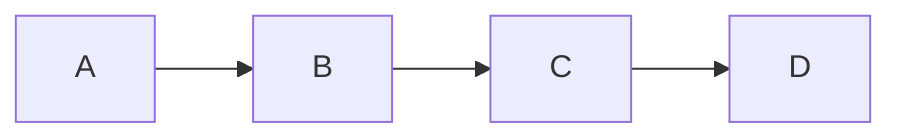
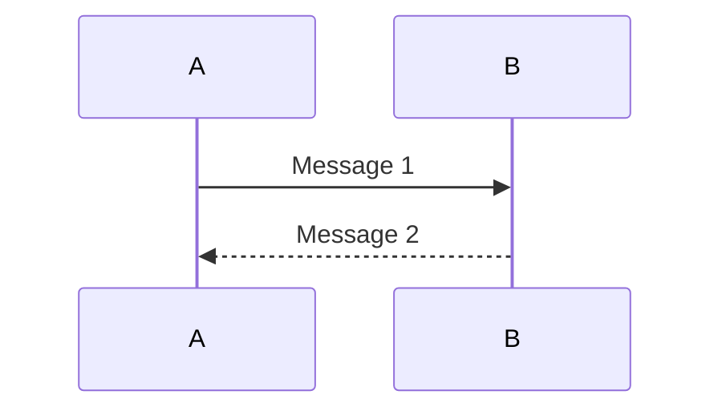
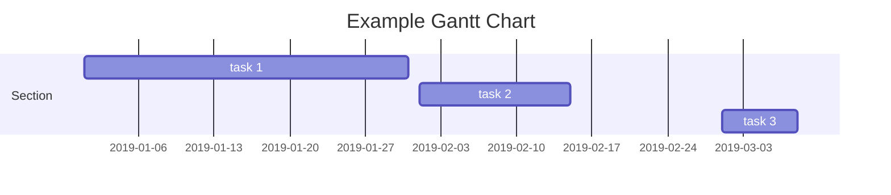
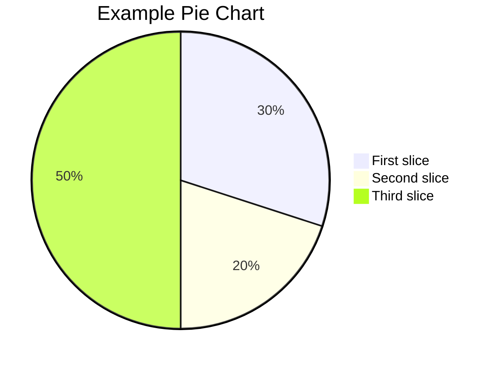
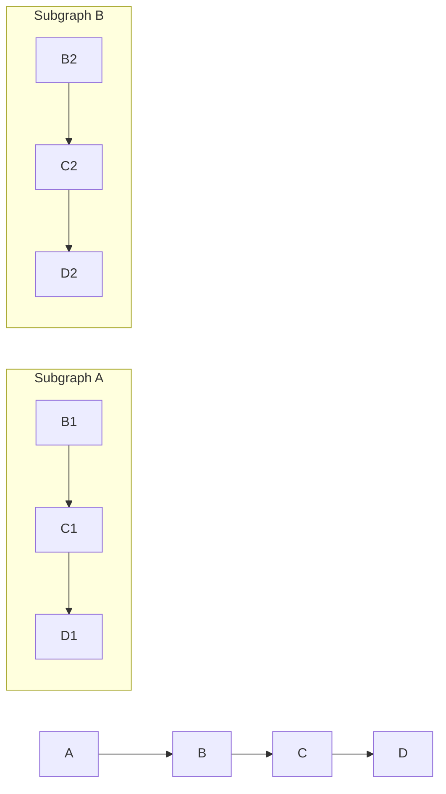
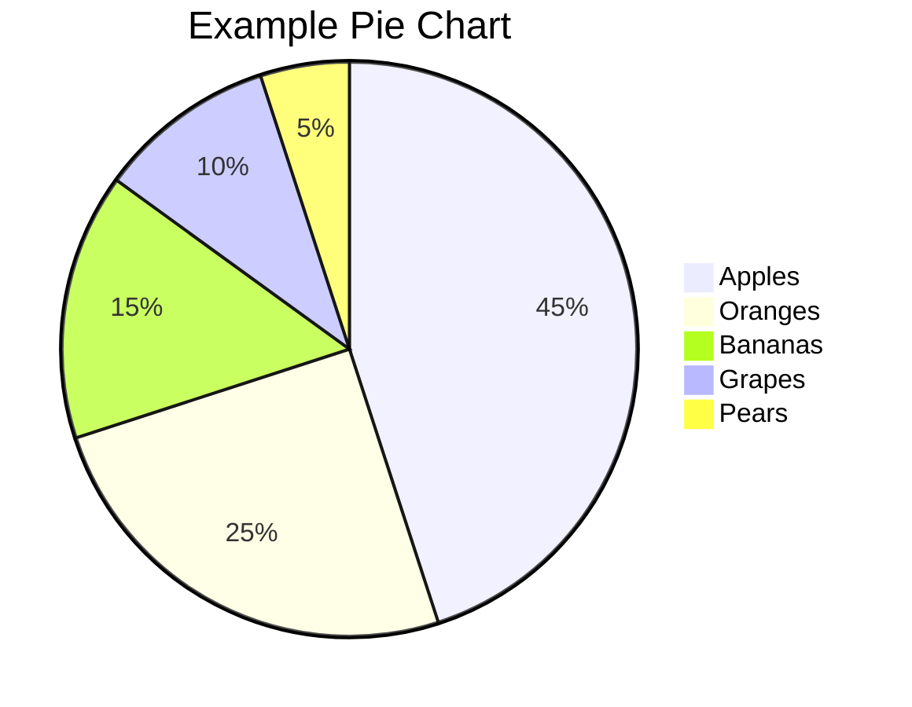
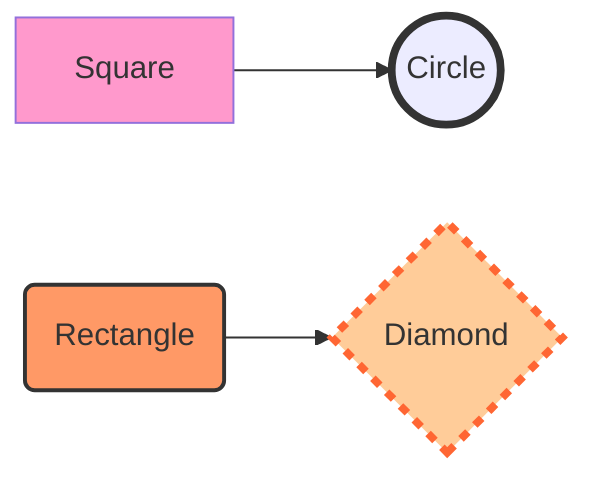

---
tags:
  - Mermaid
  - Wheel
---
# Mermaid Note

>使用 mermaid 的目的是为了给 markdown 笔记中的一些简单关系提供可视化方案，但是由于过度丰富的图形和 markdown 速记的理念是违背的，因此不对于高级的使用进行过多的阐述，只是简单的记录一些基本用法

+ References
	+ [Mermaid 从入门到精通 Zhihu](https://zhuanlan.zhihu.com/p/627356428)
	+ [Mermaid Official Site](https://mermaid.js.org/intro/)
	+ [Mermaid 中文网](https://mermaid.nodejs.cn/ecosystem/tutorials.html)
	+ [Mermaid 在线编辑器](https://mermaid-live.nodejs.cn/edit#pako:eNpVjbFugzAQhl_FuqmVSAQOwcFDpYa0WSK1Q6dCBiscGDXYyBilKfDuNURV25vu9H3_fz2cdI7AoTjry0kKY8nbLlPEzWOaSFO1thbtkSwWD8MeLam1wutAtnd7TVqpm6ZS5f3N304SSfrDpCGxslIf4w0lc_5F4UB26UE0VjfHv-TtogfylFav0tX_J9KgSz2nheCFWJyEIYkwswIelKbKgVvToQc1mlpMJ_QTzcBKrDED7tYcC9GdbQaZGl2sEepd6_onaXRXSnD159ZdXZMLi7tKlEb8KqhyNInulAUerOYK4D18Ag_Xy4iGMYsjFtHNhtHQgyvwOF7S0GcsXMWrgNEgHj34mp_6yw1b-25o5LhP18H4DT9qduw)
   + [Zensical Graph](https://zensical.org/docs/authoring/diagrams/?h=graph#diagrams)

## 基础语法练习

### Flowchart

```text
 graph LR
	 A --> B
	 B --> C
	 C --> D 
```



### Sequence Diagram

```text
sequenceDiagram
   A->>B: Message 1
   B-->>A: Message 2
```



### Gantt Chart

```text
gantt
   title Example Gantt Chart
   dateFormat  YYYY-MM-DD
   section Section
   task 1: 2019-01-01, 30d
   task 2: 2019-02-01, 14d
   task 3: 2019-03-01, 7d
```


### Pie Chart

```text
pie
   title Example Pie Chart
   "First slice": 30
   "Second slice": 20
   "Third slice": 50
```



### Radar Graph

```text
radar-beta
  axis m["Math"], s["Science"], e["English"]
  axis h["History"], g["Geography"], a["Art"]
  curve a["Alice"]{85, 90, 80, 70, 75, 90}
  curve b["Bob"]{70, 75, 85, 80, 90, 85}

  max 100
  min 0
```

`Obsidian` 不支持

## 高级语法练习

### graph and subgraph

```text
graph LR
    A --> B
    B --> C
    C --> D

    subgraph Subgraph A
        B1 --> C1
        C1 --> D1
    end

    subgraph Subgraph B
        B2 --> C2
        C2 --> D2
    end
```



### Pie



### Style 关键字语法

```text
style <shape-id> <style-attr>:<style-value>[;<style-attr>:<style-value>]...
```

其中 \<shape-id\> 是形状的 ID，而 \<shape-attr\> 是样式属性，\<style-value\> 是样式属性的值。可以为形状设置多个样式属性，多个样式属性之间用分号 ; 分隔。

```text
graph LR;
  A[Square] --> B((Circle));
  C(Rectangle) --> D{Diamond};

  style A fill:#f9c;
  style B stroke:#333,stroke-width:4px;
  style C fill:#f96,stroke:#333,stroke-width:2px;
  style D fill:#fc9,stroke:#f63,stroke-width:4px,stroke-dasharray: 5 5;
```



根据上面的例子，我们对 A、B、C 和 D 设置了不同的样式和颜色，其中 `fill` 设置形状的填充属性，而 `stroke` 样式属性设置形状的边框颜色，`stroke-width` 样式属性设置边框宽度，使用 `stroke-dasharray` 设置虚线的样式

更多的一些属性请参考官方文档

+ font-size
+ font-weight
+ font-family
+ text-align
+ text-decoration
+ etc

### loop and alt

+ loop 语法 用于定义一个循环块

```text
loop [循环次数]
   [形状 1]
   [形状 2]
   ...
end
```

+ alt 语法 用于定义一个条件块，根据条件选择不同的路径

```text
alt [条件 1]
   [路径 1]
else if [条件 2]
   [路径 2]
else
   [路径 3]
end
```


